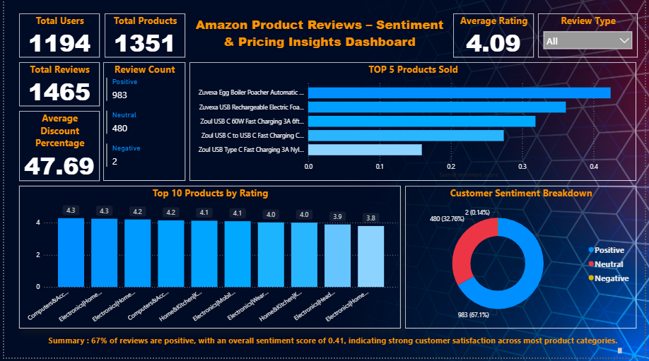

# 🧠 Customer Sentiment Analysis and Pricing Insights on Amazon Products

### 📊 Overview

This project analyzes Amazon product reviews to understand **customer sentiment** and uncover **pricing insights**.
Using Python (NLP) and Power BI (Data Visualization), it identifies the most loved product categories and explores how ratings, discounts, and prices influence customer satisfaction.



### 🧩 Objectives

* Analyze **customer sentiments** from Amazon reviews.
* Identify **top-performing categories** based on sentiment score.
* Compare **discounts, ratings, and pricing patterns**.
* Visualize insights interactively using Power BI dashboards.
### ⚙️ Tools & Libraries

⚙️ Tools & Technologies
* | Category      | Tools / Libraries                         |
| ------------- | ----------------------------------------- |
| Programming   | **Python**, **Google Colab**              |
| Data Analysis | **Pandas**, **NumPy**                     |
| NLP           | **NLTK**, **TextBlob**                    |
| Visualization | **Matplotlib**, **Seaborn**, **Power BI** |
| Data Source   | **Kaggle – Amazon Reviews Dataset**       |


### 📁 Dataset

Dataset: *Amazon Reviews Dataset*
Source: [Kaggle – Amazon Reviews](https://www.kaggle.com/datasets/karkavelrajaj/amazon-sales-dataset)
Contains columns like:

* `category`
* `discounted_price`, `actual_price`, `discount_percentage`
* `rating`, `rating_count`
* `review`, `sentiment_score`

### 📈 Key Insights

Categories with highest average sentiment scores were identified.
Discounts and ratings correlate with customer sentiment.
Power BI dashboards provide interactive insights into product performance.
Businesses can use these insights to optimize pricing and discount strategies.

Power BI Report Overview
📍 Page 1 — Sentiment Overview
Visuals showing average sentiment scores, category-wise distribution, and rating impact, Average rating, Total Users.

📍 Page 2 — Pricing vs Sentiment Analysis
Scatter chart comparing discounted prices with sentiment scores and rating count.

📍 Page 3 — Overview Table
Table with overall details to understand data better.
### 🚀 How to Run

image path : 

1. Clone the repo

   ```bash
   git clone https://github.com/vikasbachu/Customer-Sentiment-Analysis-and-Pricing-Insights-on-Amazon-Products.git

   ```
2. Open the `.ipynb` file in **Google Colab** or **Jupyter Notebook**.
3. Run all cells sequentially.

📊 View Power BI Report

Open the .pbix file in Microsoft Power BI Desktop.
Explore the 3 interactive report pages for insights.

### 🧾 Author
**Bachu Vikas**
📍 Hyderabad, Telangana, India
💼 Data & Analytics | Python - ML| Power BI | NLP
🔗 [LinkedIn](https://www.linkedin.com/in/bachu-vikas) | 

